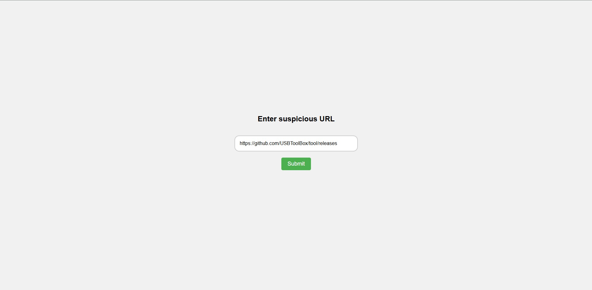
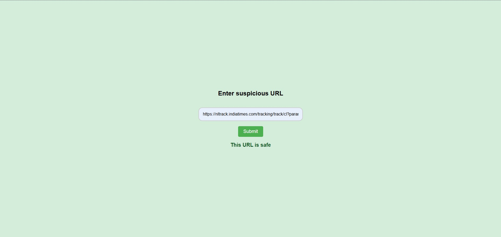
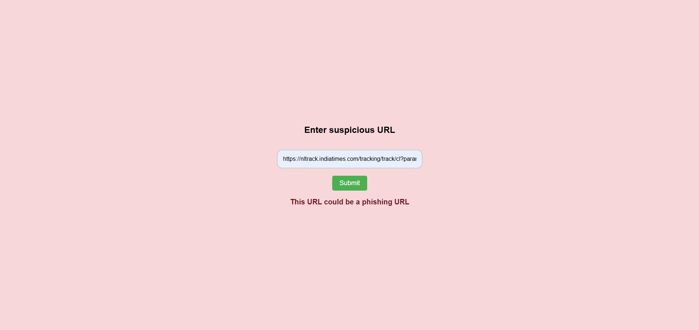
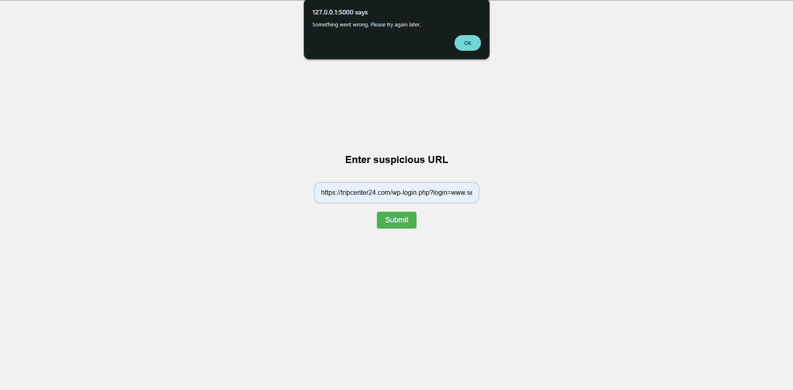

# Phishing URLs Detection Web Application #

### Overview ###

This project is a Flask-based web application that detects phishing URLs using a trained Random Forest model. Users can enter a URL in the web interface, and the system will predict whether it is benign or phishing. The model has been trained on a predefined feature set.

**Note:** This project is an early-stage prototype designed for demonstration purposes. It may contain bugs, lack proper error handling, and should not be used in a production environment without further development and testing.

### Project Structure ###

The application consists of 4 main components:

**1. Frontend (HTML, CSS, JavaScript)**

- Provides a user-friendly interface to submit URLs for verification.

- Displays whether the URL in question is benign or phishing.

**2. Feature Extraction Module (Python)**

- Takes the submitted URL as input in a string format.

- Extracts relevant features from the URL, the website's DOM tree and collects external information using different APIs.

- Packages the extracted features into a Pandas Dataframe.

**3. Prediction Module (Python, Machine Learning)**

- Uses a pretrained Random Forest Model to classify URLs.

- Requires three pickle files: the trained model (phishing_model.pkl), scaler (scaler.pkl), and shift values (shift_values.pkl) for transformation.

- Requires the dataframe returned by the Feature Extraction Module.

- Returns 0 for benign URLs, 1 for phishing URLs.

**4. Flask Application (Python, Flask)**

- Ties all of the above modules together. 

- Handles the input from the User, the inputs and outputs of the model based modules.

**5. Testing Script (test_scripts.py)**

- Testing script to isolate and test the features extraction and prediction scripts.

- The script contains a dummy URL which is used for analysis and prediction.

### Installation ###

**Packages**

- Python 3

- Flask

- Pandas

- Scikit-learn

- urllib

- requests

- BeautifulSoup

- datetime

- dateutil

- pytz

- joblib

- python-dotenv

**APIs (Credentials Required if cloned from GitHub)**

1. Google Custom Search API `(https://developers.google.com/custom-search/v1/overview)`

2. Google Custom Search Engine `(https://programmablesearchengine.google.com/about/)`

3. Open Page Rank `(https://www.domcop.com/openpagerank/)`

4. RapidAPI Ahrefs `(https://rapidapi.com/jobykjoseph10/api/ahrefs2)`

5. WHOIS `(https://whois.whoisxmlapi.com/)`

**Steps to install:**

1. Clone the repository:

    `git clone https://github.com/AnindyaChakravarty/URLClassification.git`

2. Install required dependencies:

    `pip install -r requirements.txt`

3. Create a .env file and insert the relevant API keys if cloning from git repositories. Refer to API section for details.

4. Note: Do not change the folder structure of the project. That is critical to functionality!

### Running the Application ###

To start the Flask server, execute:
`python app.py`

Then, open a browser and go to:
`http://127.0.0.1:5000`

Alternatively press CTRL and click on the link in the terminal window.

### Usage: ###

1. Enter a URL is the text box:

2. Click the submit button:

3. The application will process the URL and an output will be displayed on the webpage:

    1. Benign (0) : "This URL is safe" is displayed along with a green background.
    2. Phishing (1) : "This URL could be a phishing URL" is displayed along with a red background
    3. Error: A browser popup window is displayed - "Something went wrong. Please try again later."

4. Refresh to use the application again or in case of an error

Note: The responses are slow due to usage of APIs in the background which limit the execution speed considerably.

### Example Input/Output: ###

Example Input:

Example Outputs:

When URL is benign:

When URL is malicious:

When the application encounters an error:

### Limitations and Future Improvements ###

- Currently, the application is heavily reliant on free and slow APIs which slows down the response considerably.

- Additionally when the API usage limit is reached it disables the entire application.

- Lacks good error and edge cases handling.

- Lacks better solutions for scaling.

